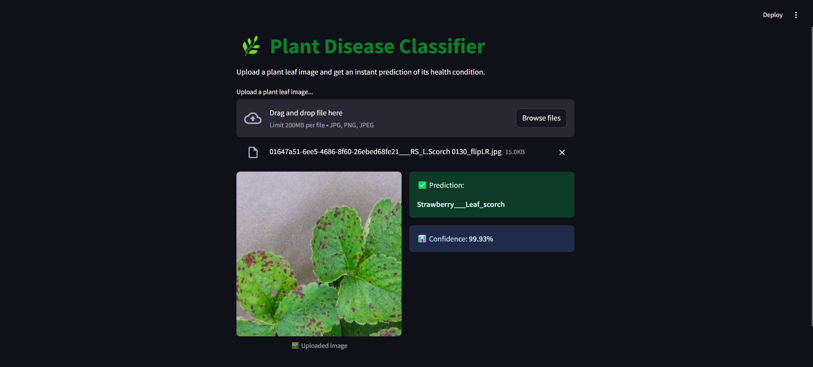
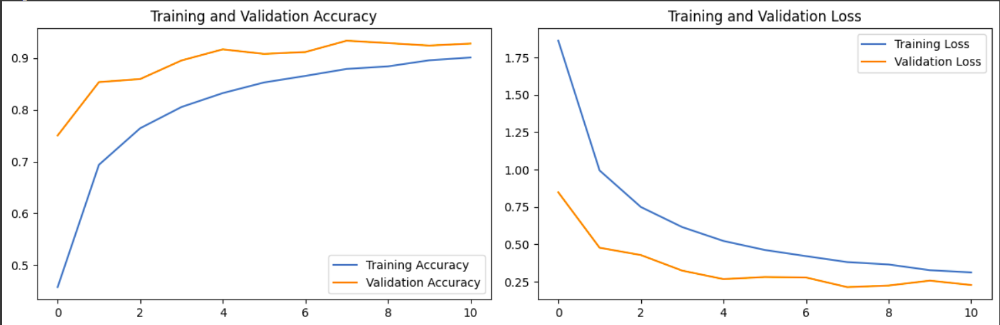

# 🪴 Plant Disease Classifier – Deep Learning Web App
## 🌿 Overview
Plant Disease Classifier using Deep Learning and Streamlit A web application that uses a Convolutional Neural Network (CNN) model to classify plant leaf images into various disease categories. Built with TensorFlow and deployed using Streamlit, this project enables real-time predictions with confidence scores from uploaded leaf images.



---
👉 [Watch Demo Video](https://drive.google.com/file/d/1K-2RMCY0YYbBcdHEUuSQFg6XVzTM-Kuq/view?usp=sharing)

---

## 🔍 Features
- 🖼️ Upload or drag & drop a leaf image.
- 🧠 Predicts plant disease from **38 different classes**.
- 📊 Displays class name with **confidence score**.
- 💻 Clean UI built with **Streamlit**.

---

## 🧠 Tech Stack
- **TensorFlow 2.x** – Deep learning framework.
- **Keras** – Model building and training.
- **Streamlit** – Web interface for user interaction.
- **Python** – Core programming language.
- **NumPy**, **Pandas**, **Matplotlib** – Data handling and visualization.

---

## 📦 Dataset
- **PlantVillage Dataset** – Contains over 50,000 images of healthy and diseased plant leaves.
- Publicly available on Kaggle:
 🔗 [Kaggle Dataset](https://www.kaggle.com/datasets/vipoooool/new-plant-diseases-dataset/data)

---

## 🚀 Highlights
- Custom CNN model with effective performance.
- Data preprocessing 
- Deployable on **Streamlit Cloud**, or any cloud service.

---

## 📈 Model Performance

The model was trained on the PlantVillage dataset and achieved strong classification results.

### 🔹 Accuracy vs. Loss Curves



- **Training Accuracy**: ~92%  
- **Validation Accuracy**: ~93%  

  
---

## 📌 Impact
This tool can assist in:
- Timely and accurate disease detection.
- Supporting farmers with instant diagnosis.
- Reducing unnecessary pesticide use and boosting yields.

---
## 🧬 Model Architecture

The Plant Disease Classifier uses a custom **Convolutional Neural Network (CNN)** built with TensorFlow Keras. The model is lightweight yet powerful, making it suitable for real-time prediction on web apps.

### 🔧 Architecture Summary:

```python
Input: 128x128x3 RGB Image
↓
Rescaling (1./255)
↓
Conv2D (32 filters, 3x3) + ReLU → MaxPooling
↓
Conv2D (64 filters, 3x3) + ReLU → MaxPooling
↓
Conv2D (128 filters, 3x3) + ReLU → MaxPooling
↓
Dropout (0.3)
↓
Flatten → Dense (128) + ReLU → Dropout (0.5)
↓
Dense (Softmax with 38 outputs)
```

--- 

## 🤝 Contributing

Contributions are welcome!  

If you have ideas to improve this project, feel free to:

1. Fork the repository  
2. Create a new branch (`git checkout -b feature-name`)  
3. Commit your changes (`git commit -m 'Add new feature'`)  
4. Push to the branch (`git push origin feature-name`)  
5. Open a Pull Request

Let's build something great together 🌱

---

## 📄 License

This project is licensed under the [MIT License](LICENSE).  
You are free to use, modify, and distribute this project with proper attribution.

---

